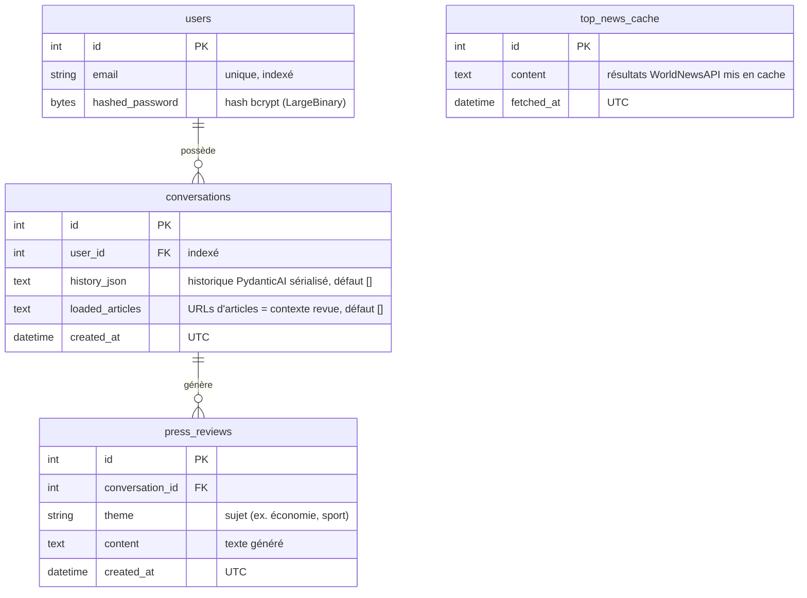

# Architecture Backend - NewsFoundry
 
## Vue d'ensemble
 
Le backend est une API **FastAPI** (Python 3.13) qui expose les fonctionnalités de chat IA et de revue de presse à un frontend Next.js. Il orchestre trois briques externes :
 
- **Mistral** (`mistral-small-latest`) via **PydanticAI** pour l'agent conversationnel
- **WorldNewsAPI** pour la récupération des actualités
- **LlamaIndex + MistralAIEmbedding** pour le RAG (indexation et recherche sémantique des articles scrapés)
Les données persistantes (utilisateurs, conversations, messages) sont stockées dans **PostgreSQL** (hébergé sur Railway), via **SQLAlchemy** et des migrations **Alembic**. Le tout tourne en conteneurs **Docker**.
 
```
Frontend (Next.js)
      │
      ▼
FastAPI ──► PostgreSQL (Railway)
   │  │
   │  └──► PydanticAI ──► Mistral API
   │
   └──► LlamaIndex/RAG ──► scraping (aiohttp/trafilatura) ──► WorldNewsAPI
```
 
---
 
## Stack technique
 
| Techno | Rôle | Pourquoi ce choix |
|---|---|---|
| FastAPI | Framework API | Async natif, validation Pydantic intégrée, bien adapté à un projet IA |
| SQLAlchemy | ORM | Typage moderne, compatible Alembic |
| Alembic | Migrations DB | Standard de l'écosystème SQLAlchemy |
| pydantic-settings | Config/env vars | Validation de la config au démarrage, cohérent avec l'écosystème Pydantic |
| PydanticAI | Orchestration agent | Intégration native avec Pydantic pour typer les réponses de l'agent |
| LlamaIndex | RAG | Abstraction mature pour l'indexation vectorielle et la recherche sémantique |
| Tenacity | Retry | Décorateurs simples pour gérer les appels réseau capricieux |
| `uv` | Gestion de packages | Rapide, remplace pip/poetry |
| Docker | Conteneurisation | Reproductibilité dev/prod |
| Bruno | Tests API manuels | Alternative légère à Postman |
 
---
 
## Arborescence
 
```
backend/
├── Dockerfile
├── entrypoint.sh                 # script de démarrage du conteneur
├── alembic/                      # migrations de base de données
│   ├── env.py
│   └── versions/                 # migrations versionnées (init + press_reviews)
├── alembic.ini
├── pyproject.toml                # dépendances (géré par uv)
├── uv.lock
└── src/
    ├── main.py                   # point d'entrée FastAPI (app + lifespan)
    ├── config.py                 # pydantic-settings (env vars validées)
    ├── database.py               # engine + session SQLAlchemy
    ├── exceptions.py             # exceptions métier (NewsAPIError, etc.)
    ├── clients/
    │   └── worldnews_client.py   # call_worldnews_api centralisé (timeout/retry/erreurs)
    ├── models/                   # modèles SQLAlchemy (Mapped/mapped_column)
    │   ├── base.py               # Base déclarative
    │   ├── users.py
    │   ├── conversations.py
    │   ├── press_review.py
    │   └── top_news.py
    ├── routers/                  # endpoints FastAPI
    │   ├── auth.py
    │   └── conversations.py
    ├── schemas/                  # schémas Pydantic 
    │   ├── auth.py
    │   ├── conversations.py
    │   ├── news.py
    │   ├── press_review.py
    │   ├── response.py           # ApiResponse[T] générique
    │   └── users.py
    ├── services/                 # logique métier
    │   ├── ai_service.py         # agent PydanticAI + _run_agent
    │   ├── news_service.py       # search_news
    │   ├── scraping_service.py   # aiohttp + trafilatura
    │   └── press_review_service.py  # pipeline RAG complet
    ├── scripts/
    │   └── init_db.py            # initialisation DB
    ├── tests/
    │   ├── conftest.py
    │   └── test_conversations_authorization.py
    └── utils/
        ├── conversations.py      # get_owned_conversation_or_40X
        └── security.py           # JWT, hashing bcrypt
```
 
> Généré avec `tree` (dossiers `__pycache__`, `.venv`, `.git` exclus).
 
---
 
## Modèle de données
 
Quatre tables, définies avec SQLAlchemy (`Mapped`/`mapped_column`) dans `src/models/`.
 

 
**Détail des tables**
 
- **`users`** : authentification. Le mot de passe est stocké en `LargeBinary` (bytes) pour accueillir directement le hash bcrypt. L'email est `unique` et indexé pour accélérer le lookup à la connexion.
- **`conversations`** : cœur du chat. `history_json` stocke l'historique complet des messages sérialisé au format `pydantic_ai.messages.ModelMessagesTypeAdapter`, c'est ce qui permet à `ai_service.py` de reconstruire le contexte et de continuer la conversation. `loaded_articles` garde la liste des URLs d'articles référencés dans la conversation, qui servent de contexte à la génération de revue de presse.
- **`press_reviews`** : une revue de presse générée, rattachée à la conversation qui l'a déclenchée (relation 1-N : une conversation peut produire plusieurs revues).
- **`top_news_cache`** : table **autonome** (aucune relation). Elle met en cache les résultats de recherche WorldNewsAPI pour éviter de consommer inutilement des crédits d'API sur des requêtes rapprochées.
> Note : le cache `top_news_cache` est une réponse partielle à la piste « cache » des axes d'amélioration. La version actuelle couvre les *top news*, une généralisation à toutes les recherches reste à faire.
 
---
 
## Choix d'implémentation clés
 
### 1. `ApiResponse[T]` - wrapper générique de réponse
 
**Contexte** : besoin d'un format de réponse cohérent entre tous les endpoints, consommable de façon prévisible côté frontend (via `safeParse` Zod).
 
**Décision** : toutes les réponses API passent par un wrapper générique `ApiResponse[T]`, avec discrimination `success: true/false`.
 
**Alternative envisagée** : laisser chaque endpoint retourner sa propre forme de réponse (ou uniquement les `HTTPException` FastAPI natives).
 
**Pourquoi ce choix** :
 
| | `ApiResponse[T]` générique | Réponses ad-hoc par endpoint |
|---|---|---|
| ✅ Avantages | Contrat unique et prévisible, le frontend peut factoriser tout son parsing/gestion d'erreur | Moins de boilerplate au démarrage |
| ❌ Inconvénients | Un peu de verbosité à chaque endpoint | Le frontend doit gérer N formats différents, fragile à l'échelle |
 
Le design reste défensif : les branches côté frontend couvrent à la fois les `HTTPException` FastAPI (`{detail: string}`) et les `success: false` manuels, car le backend peut se comporter de façon inattendue (erreurs non interceptées, etc.).
 
---
 
### 2. Centralisation réseau - `call_worldnews_api`
 
**Contexte** : WorldNewsAPI est capricieuse (timeouts, réponses `status:failure`, JSON parfois invalide).
 
**Décision** : toute la robustesse réseau (timeout 30s, retry Tenacity, gestion des erreurs de format) est centralisée dans une seule fonction, `call_worldnews_api`. `search_news` et tout futur appel en bénéficient automatiquement.
 
**Alternative envisagée** : gérer le retry/timeout au niveau de chaque service appelant.
 
**Pourquoi ce choix** :
 
| | Centralisation dans `call_worldnews_api` | Gestion dispersée par service |
|---|---|---|
| ✅ Avantages | Un seul endroit à maintenir/tester, les services au-dessus restent propres et lisibles | - |
| ❌ Inconvénients | Toute évolution de la logique réseau doit rester générique (pas de cas trop spécifique à un service) | Duplication de logique, risque d'incohérence entre services |
 
Point d'attention : `NewsAPITimeoutError` est explicitement **exclue** des retries Tenacity, pour éviter l'empilement de cascades de timeout (retry sur retry).
 
---
 
### 3. Isolation des retries - extraction de `_run_agent()`
 
**Contexte** : l'agent PydanticAI peut appeler des tools avec effets de bord (ex. `store_article_urls`). Si on retry l'appel agent complet en cas d'erreur réseau, on risque de rejouer aussi ces effets de bord.
 
**Décision** : `_run_agent()` est extrait pour ne rejouer **que l'appel réseau**, jamais les effets de bord des tools.
 
**Pourquoi ce choix** : évite les doubles écritures / doublons en cas de retry après un tool call déjà exécuté avec succès.
 
---
 
### 4. Propagation contextuelle des erreurs
 
**Contexte** : une même exception (`NewsAPIError`) doit être traitée différemment selon qui l'appelle.
 
**Décision** :
- Dans l'**agent de chat**, l'erreur est absorbée et transformée en message naturel pour le LLM (l'utilisateur reçoit une réponse conversationnelle, pas un crash)
- Dans `press_review_service`, l'erreur est remontée en **503** (le frontend doit savoir que ça a explicitement échoué)
**Pourquoi ce choix** : le même problème technique a un traitement UX différent selon le contexte fonctionnel, un chat doit rester fluide même en cas d'erreur externe, une génération de revue de presse doit signaler clairement l'échec.
 
---
 
### 5. `get_owned_conversation_or_40X` - sécurité factorisée
 
**Contexte** : chaque endpoint touchant une conversation doit vérifier que l'utilisateur en est bien propriétaire (403/404 sinon), sous peine de duplication de logique de sécurité.
 
**Décision** : utilitaire factorisé `get_owned_conversation_or_40X`, appelé systématiquement avant toute opération sur une conversation.
 
**Pourquoi ce choix** : centralise un point de sécurité critique, une seule fonction à auditer/tester plutôt que N vérifications dispersées et potentiellement incohérentes.
 
Couvert par des tests dédiés (nominal + accès non autorisé).
 
---
 
### 6. Logging structuré (WorldNewsAPI)
 
**Contexte** : WorldNewsAPI étant capricieuse, il fallait de la visibilité sur ses appels.
 
**Décision** : module `logging` Python avec configuration centralisée, appliqué en priorité sur l'interrogation de WorldNewsAPI.
 
**Pourquoi ce choix** : logs filtrables par niveau (`INFO`/`WARNING`/`ERROR`), exploitables en prod contrairement à des `print()`.
 
---
 
## Points d'attention techniques
 
- **FastAPI + `lifespan`** : les initialisations globales (LlamaIndex, etc.) passent systématiquement par le `lifespan` context manager. Piège identifié avec `reload=True`, qui n'exécute l'init que dans le processus parent.
- **Alembic** : l'import de `Base` doit passer par `__init__.py` pour que tous les modèles soient bien enregistrés dans `metadata` avant `autogenerate`.
---
 
## Pipeline RAG (revue de presse)
 
1. **Recherche** : `search_news` interroge WorldNewsAPI (via `call_worldnews_api`)
2. **Scraping** : récupération du contenu complet des articles via `aiohttp` + `trafilatura`
3. **Indexation** : construction d'un index vectoriel avec **LlamaIndex** + **MistralAIEmbedding**
4. **Génération** : synthèse de la revue de presse par l'agent Mistral, à partir du contexte indexé
---
 
## Flux principaux
 
Les parcours de bout en bout (chat, génération de revue de presse, authentification) impliquent à la fois le frontend et le backend. Ils sont documentés sous forme de diagrammes de séquence dans **[`FLUX.md`](./FLUX.md)**.
 
---
 
## Lancer le projet

Le projet utilise des scripts `uv` définis dans `pyproject.toml` (`start_db`, `api`, `init_db`).
 
**En développement**
 
```bash
uv run start_db   # démarre un conteneur PostgreSQL
uv run api        # lance l'API FastAPI
```
 
**En production (Docker)**
 
Le conteneur est piloté par `entrypoint.sh`, qui enchaîne automatiquement, avec `set -e` (arrêt immédiat si une étape échoue) :
 
```sh
uv run alembic upgrade head   # applique les migrations
uv run init_db                # initialise la base
exec uv run api               # démarre l'API
```
 
```bash
docker build -t newsfoundry-api .
docker run --env-file .env newsfoundry-api
```
 
Variables d'environnement nécessaires : [`.env.example`](../backend/.env.example).
 
## Lancer les tests
 
```bash
uv run pytest
```
 
CI : GitHub Actions, exécutée sur `ubuntu-latest` avec `uv`, incluant les tests d'autorisation (nominal + accès non autorisé).