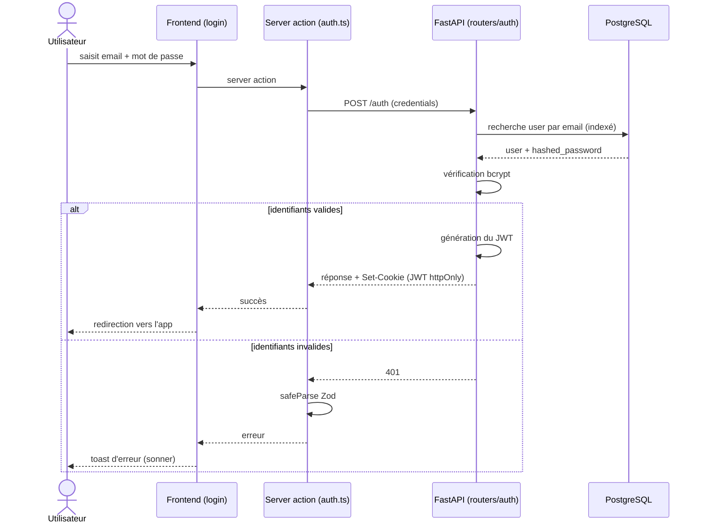
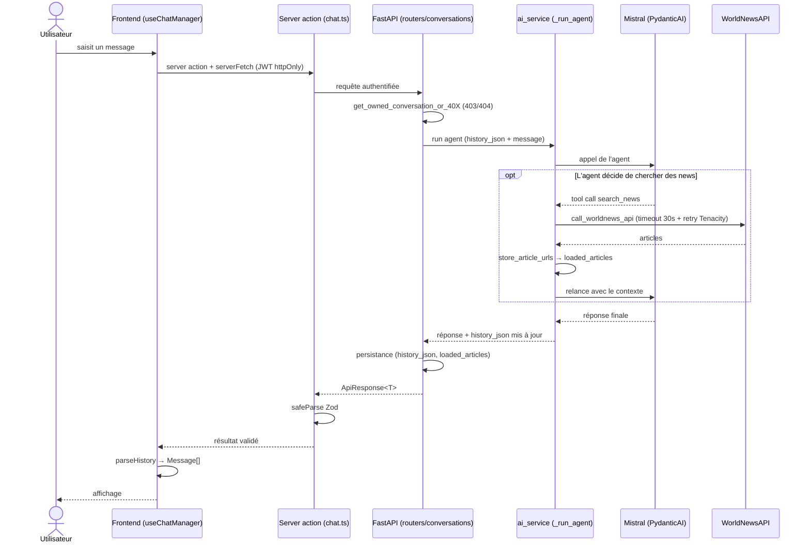
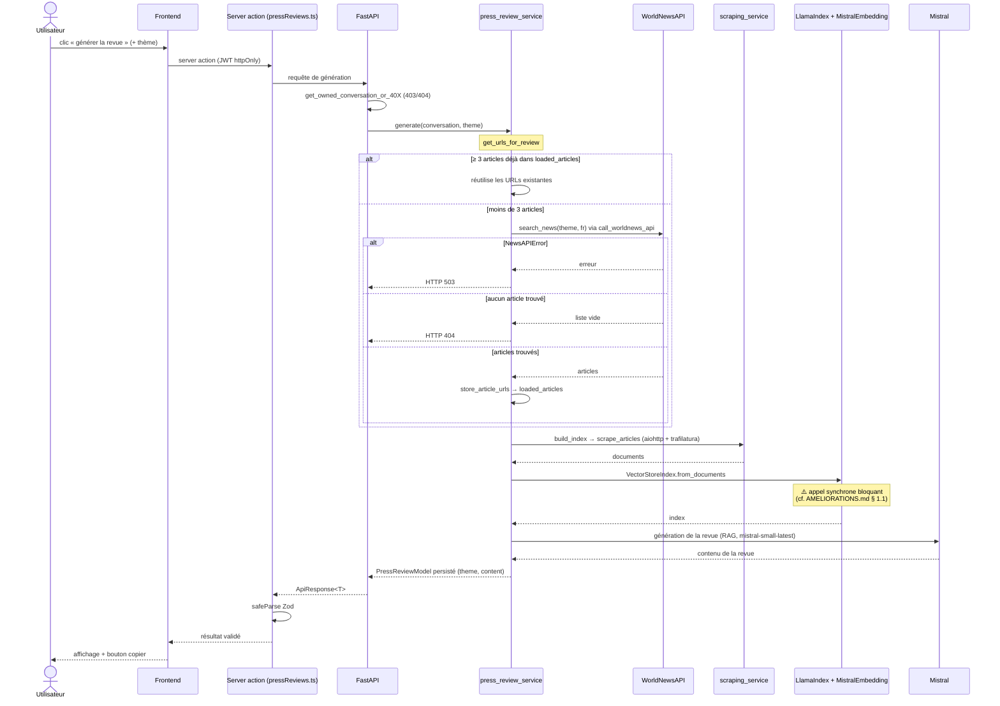

# Flux principaux - NewsFoundry
 
Ce document décrit les parcours de bout en bout de l'application. Chacun traverse le frontend (Next.js) et le backend (FastAPI), d'où un fichier dédié plutôt qu'une répartition entre `FRONTEND.md` et `BACKEND.md`.
 
Les diagrammes sont en [Mermaid](https://mermaid.js.org/), rendus nativement sur GitHub/GitLab.
 
---
 
## 1. Authentification
 
Connexion par email/mot de passe, avec émission d'un JWT stocké en cookie `httpOnly` (jamais accessible au JavaScript client, protection contre le vol de token par XSS).
 

 
---
 
## 2. Envoi d'un message chat
 
L'agent PydanticAI peut décider d'appeler l'outil `search_news` pour enrichir sa réponse. Les URLs des articles récupérés sont persistées dans `conversation.loaded_articles` (elles serviront de contexte à une éventuelle revue de presse).
 

 
> En cas d'erreur WorldNewsAPI pendant le chat, l'exception `NewsAPIError` est **absorbée** par l'agent : elle est transformée en message naturel pour le LLM, de sorte que la conversation reste fluide plutôt que de crasher (comportement volontairement différent de la génération de revue - cf. flux 3).
 
---
 
## 3. Génération d'une revue de presse
 
Le point clé est la logique **hybride** de `get_urls_for_review` : la revue réutilise les articles déjà chargés dans la conversation s'il y en a assez (≥ 3), sinon elle déclenche une recherche WorldNews fraîche sur le thème demandé, puis la met en cache dans `loaded_articles`.
 

 
**Différence de traitement des erreurs avec le chat** : ici, une `NewsAPIError` est **remontée explicitement en 503** (l'utilisateur doit savoir que la génération a échoué), là où l'agent de chat l'absorbe pour rester conversationnel. Même exception, traitement contextuel différent.
 
---
 
## Configuration LlamaIndex (contexte des flux RAG)
 
Les modèles utilisés par la pipeline RAG sont configurés globalement au démarrage via `init_llama_index()` :
 
- **Embeddings** : `mistral-embed` (MistralAIEmbedding)
- **LLM** : `mistral-small-latest`, avec `timeout=20s`, `max_retries=3`, `max_tokens=2048`
Cette initialisation globale passe par le `lifespan` de FastAPI (cf. `BACKEND.md`) pour éviter le piège du `reload=True` qui n'exécuterait l'init que dans le processus parent.
 